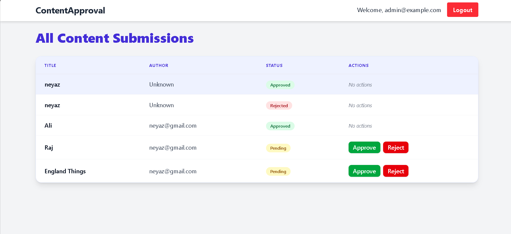
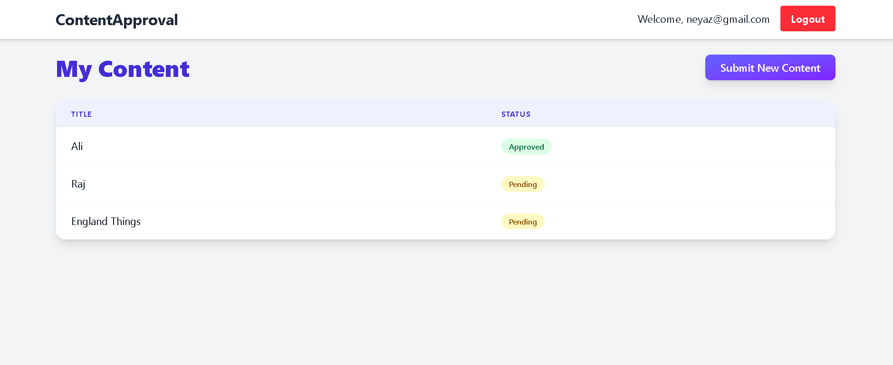
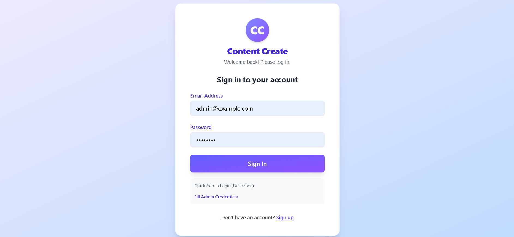

ContentApproval Project
ContentApproval is a streamlined web application designed for the submission, review, and approval of content. It offers a simple interface for users to submit new content and allows administrators to manage all submissions through various approval stages. Below you'll find details about the project's features, functionality, and visual walkthroughs.
## Project Screenshots

Features
User Dashboard: Users can view the status of their submissions (Approved, Pending) and add new content.

Content Submission: Clean and intuitive form for submitting content with title and description (500-character limit).

Admin Panel: Administrators can review, approve, or reject content submissions from all users.

Authentication: Login and logout functionality for both users and administrators.

Visual Walkthrough
1. User Dashboard
Displays a list of submitted content.

Shows status: Approved or Pending.

Button to submit new content.

2. Content Submission Page
Enter content title and description.

Character counter for description.

Submit button with return link to Dashboard.

3. Admin Login
Simple login form for administrator access.

Options for quick admin login in development mode.

4. Admin Dashboard
Lists all content submissions with author and status.

Actions to approve or reject pending content.

Shows all submissions for comprehensive management.

Getting Started
Prerequisites
Node.js and npm installed

(Optionally) a backend API or mock server for managing content and authentication

Installation
bash
git clone <your-repo-url>
cd contentapproval
npm install
Running the Project
bash
npm start
Visit http://localhost:3000 in your browser.

Usage
Login with your credentials.

Submit new content as a user with title and description.

View submission status on the dashboard.

Admin Panel: log in as admin to approve or reject submissions.

Folder Structure Example
text
/src
  /components
    - UserDashboard.js
    - ContentForm.js
    - AdminDashboard.js
    - Login.js
  /assets
    - images/
  App.js
  index.js
Screenshots
All interface images are shown above for a visual guide to each feature and workflow.

Contributing
Feel free to fork, make pull requests, or submit issues for new features or bug fixes.
